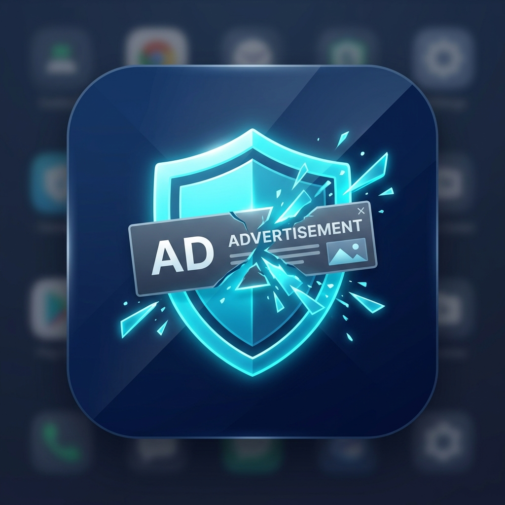
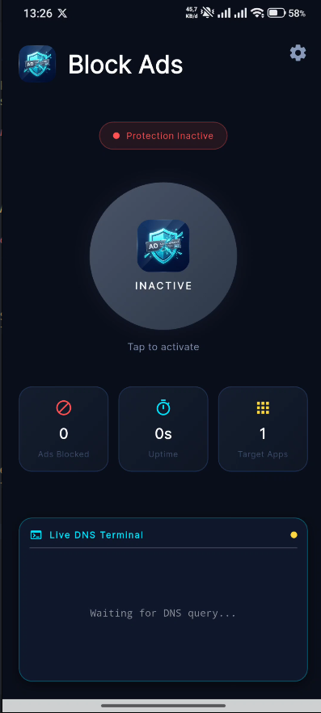
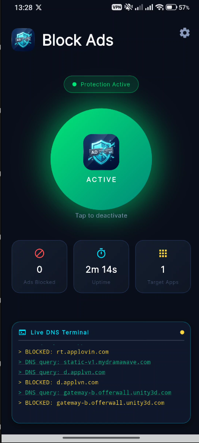
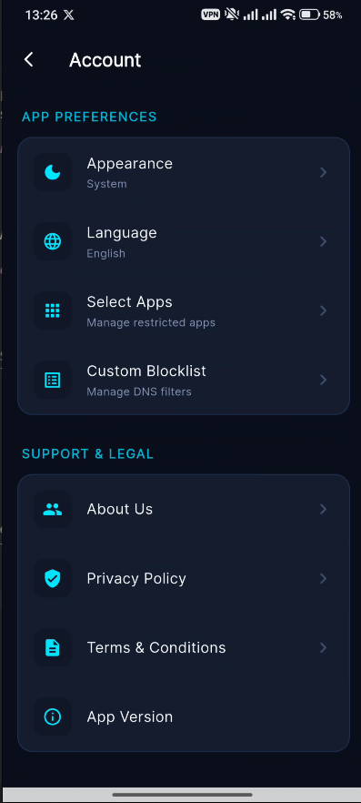
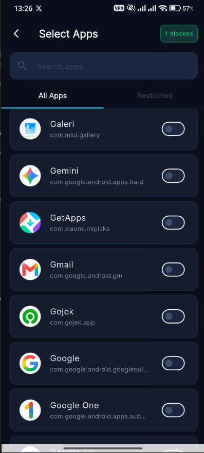
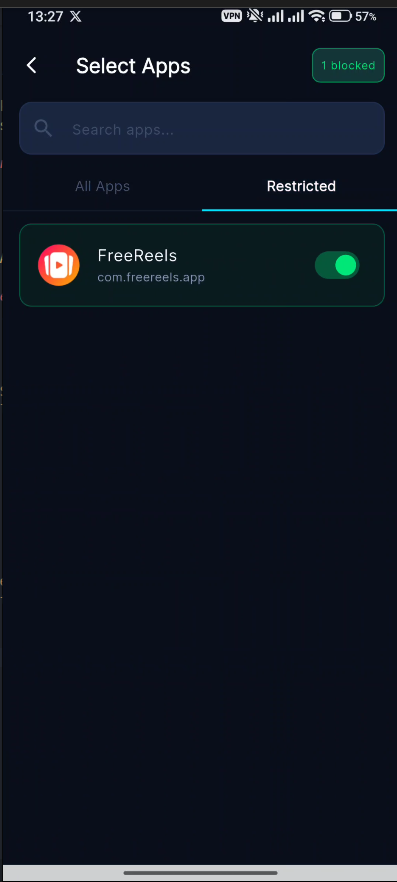

<p align="center">
  
</p>

<h1 align="center">Blokir Ads</h1>

<p align="center">
  <b>Pemblokir Iklan VPN Lokal · Penyaringan DNS Cerdas</b><br>
  Target Per Aplikasi · Privasi Utama · Tanpa Root
</p>

<p align="center">
  
  
  
  
  <br>
  
</p>

<p align="center">
  🌐 🇮🇩 <a href="README.md">Bahasa Indonesia</a> | 🇬🇧 <a href="README_en.md">English</a>
</p>

---

**Blokir Ads** adalah aplikasi Android open-source premium yang dibangun menggunakan Flutter untuk memblokir iklan digital di aplikasi lain melalui VPN lokal di dalam perangkat. Aplikasi ini beroperasi tanpa memerlukan akses root dan memungkinkan pengguna untuk memilih secara spesifik aplikasi mana saja yang ingin diblokir iklannya.

<p align="center">
  
  
  
  
  
</p>

---

## ✨ Fitur Utama

- **🎯 Target Per Aplikasi**: Pilih secara spesifik aplikasi mana yang ingin diblokir iklannya. Terowongan VPN hanya akan menyaring lalu lintas dari aplikasi yang Anda pilih, sementara koneksi aplikasi lain tetap tidak tersentuh.
- **🚫 Tanpa Root**: Menggunakan fitur bawaan Android `VpnService` untuk melakukan intersepsi di tingkat DNS. Tidak memerlukan perangkat yang di-root.
- **⚡ Pemrosesan Lokal (Privasi Utama)**: Semua intersepsi DNS dan perutean lalu lintas terjadi secara lokal di perangkat Anda. Tidak ada data yang dikirim ke server VPN eksternal.
- **🌐 Daftar Blokir Berlapis**: Menggabungkan daftar blokir statis bawaan, daftar blokir dinamis dari komunitas (100.000+ domain dari Steven Black & Hagezi), dan daftar blokir khusus yang dapat ditentukan pengguna.
- **🎨 UI Gelap Premium**: Menampilkan tema gelap bergaya glassmorphism yang modern dan elegan (Deep Navy dan Electric Cyan) untuk pengalaman pengguna premium.

---

## 🛠️ Cara Kerjanya (Detail Teknis)

Berbeda dengan pemblokir iklan tradisional yang memodifikasi file hosts (membutuhkan root) atau merutekan semua lalu lintas melalui server eksternal (menimbulkan masalah privasi), **Blokir Ads** menggunakan mekanisme loopback VPN lokal.

1. **Pemilihan Aplikasi**: Saat pengguna memilih aplikasi target (misalnya, game gratis yang penuh iklan), UI Flutter mengirimkan nama paket (package name) ke lapisan asli Android melalui `MethodChannel`.
2. **Konfigurasi VPN**: Kode Kotlin native memulai `VpnService`. Secara krusial, ia menggunakan `builder.addAllowedApplication(packageName)`. Hal ini memberitahu OS Android untuk merutekan *hanya* lalu lintas dari aplikasi yang dipilih ke antarmuka VPN khusus kami.
3. **Intersepsi DNS**: Aplikasi menjalankan thread pemrosesan paket yang mendengarkan lalu lintas UDP di port 53 (permintaan DNS).
4. **Inspeksi Paket Cerdas** *(Diperbarui)*:
   - Setiap permintaan DNS dari aplikasi target diintersepsi dan diperiksa melalui **sistem keputusan 3-lapis**:
     1. **Daftar Blokir Khusus (Prioritas 0)** — Domain yang diblokir oleh pengguna diperiksa pertama kali.
     2. **Daftar Blokir Dinamis (Prioritas 1)** — 100.000+ domain iklan yang bersumber dari komunitas diperiksa.
     3. **Daftar Blokir Statis (Prioritas 2)** — Domain jaringan iklan yang ditanam (hardcoded) sebagai perlindungan terakhir (berfungsi secara offline).
   - **Jika diblokir**: Layanan mengembalikan respons DNS palsu yang mengarah ke `0.0.0.0` (null-route). Jaringan iklan gagal dimuat.
   - **Jika diizinkan**: Permintaan DNS diteruskan ke DNS publik Google (`8.8.8.8`), dan respons aslinya dikembalikan dengan lancar.

---

## 🛑 Apa yang Bisa & Tidak Bisa Diblokir (Keterbatasan)

Karena sifat pemblokiran iklan berbasis DNS, tidak semua iklan dapat diintersepsi. Penting untuk memahami perbedaan antara **Iklan Pihak Ketiga** dan **Iklan Pihak Pertama**.

### ✅ Berhasil Diblokir (~70–80% Iklan)
Aplikasi yang bergantung pada jaringan iklan eksternal (seperti Google AdMob, Unity Ads, AppLovin, dll.) berhasil diblokir. Permintaan iklan dikirim ke domain yang berbeda dari konten utamanya.
- **Game Gratis** (mis. Mobile Legends, Subway Surfers, Candy Crush)
- **Aplikasi Utilitas** (mis. Pengelola file, editor foto, aplikasi cuaca)
- **Pembaca Berita & Media Sosial Alternatif**
- **Aplikasi Streaming yang menggunakan iklan video AdMob / AppLovin**

### ❌ Tidak Bisa Diblokir (Iklan Pihak Pertama)
Platform raksasa teknologi menyajikan iklan mereka dari **domain yang persis sama** dengan konten aktual mereka. Jika kita memblokir domain ini melalui DNS, aplikasi tersebut akan rusak sama sekali.
- **YouTube / YouTube Music**: Iklan video berasal dari server yang sama dengan video aktual (`googlevideo.com`).
- **Instagram / Facebook**: Postingan sponsor disuntikkan langsung ke feed dari CDN yang sama (`cdninstagram.com`).
- **TikTok & X (Twitter)**: Iklan bawaan serupa yang disajikan dari CDN konten.
- **Iklan HTTPS/DoH**: Jaringan iklan yang menggunakan DNS-over-HTTPS (port 443) melewati port 53 dan tidak dapat diintersepsi oleh VPN ini.

> **Saran Terbaik:** Untuk aplikasi seperti YouTube, pemblokir iklan DNS bukan alat yang tepat. Anda harus menggunakan aplikasi klien modifikasi (mis. YouTube ReVanced atau NewPipe) yang menghapus iklan pada tingkat kode/API daripada tingkat jaringan.

### ⚠️ Keterbatasan Sistem Hadiah (Reward Points)
Aplikasi ini dirancang murni untuk **memblokir iklan secara agresif**. Karena sebagian besar aplikasi penghasil uang/koin (yang mengharuskan Anda menonton video) mewajibkan video iklan tersebut benar-benar diunduh dari server mereka, memblokir iklannya akan membuat sistem hadiah tersebut gagal (biasanya akan muncul error "Tidak ada koneksi internet"). Oleh karena itu, **fitur poin/hadiah yang bergantung pada menonton iklan kemungkinan besar tidak akan berfungsi**. Gunakan Blokir Ads hanya jika Anda benar-benar merasa kesal dengan banyak iklan dan tidak keberatan kehilangan poin harian tersebut.

---

## 🏗️ Arsitektur & Teknologi

Proyek ini secara ketat mengikuti prinsip **Clean Architecture** untuk memisahkan logika dan memastikan kemudahan pemeliharaan.

### Flutter (Lapisan Frontend & Logika)
- **Domain**: Entitas, Repositori (Antarmuka), dan Usecase.
- **Data**: Model, Datasources, dan Implementasi Repositori.
- **Presentation**: UI (Halaman/Widget) dan State Management (Cubit).
- **State Management**: `flutter_bloc`
- **Dependency Injection**: `get_it`

### Android (Lapisan Native)
- **Bahasa**: Kotlin
- **Mesin Inti**: `android.net.VpnService`
- **Pengelola Daftar Blokir**: `DynamicBlocklistManager` — mengunduh otomatis dan menyimpan cache 100.000+ domain dari sumber komunitas (Steven Black, Hagezi, AdGuard Mobile, HostsVN). Cache diperbarui setiap 7 hari.
- **Komunikasi**: Flutter `MethodChannel` (`com.dwd.blokirads/vpn` dan `com.dwd.blokirads/apps`)

---

## 📋 Changelog

### v1.0.0 — Rilis Awal
- ✅ Pemblokiran iklan DNS berbasis VPN per aplikasi tanpa root
- ✅ Daftar blokir statis bawaan untuk 30+ jaringan iklan besar (AdMob, Unity, AppLovin, dll.)
- ✅ Daftar blokir dinamis yang diunduh otomatis dari sumber komunitas (100.000+ domain)
- ✅ Daftar blokir khusus yang ditentukan pengguna
- ✅ UI gelap premium dengan terminal log DNS langsung (real-time)
- ✅ Notifikasi latar depan (foreground) dengan penghitung pemblokiran langsung

---

## 🚀 Memulai

### Prasyarat
- Flutter SDK (v3.0.0 atau lebih tinggi)
- Android Studio / Android SDK
- Perangkat Android fisik yang menjalankan API 21+ (Menguji fitur VPN di emulator dapat menyebabkan masalah jaringan yang tidak terduga).

### Instalasi

1. Klon repositori ini:
   ```bash
   git clone https://github.com/dwdprojects/blokir-ads.git
   ```
2. Masuk ke direktori proyek:
   ```bash
   cd blokir-ads
   ```
3. Instal dependensi Flutter:
   ```bash
   flutter pub get
   ```
4. Jalankan aplikasi di perangkat Android yang terhubung:
   ```bash
   flutter run
   ```

### Membangun APK
Untuk menghasilkan file rilis APK:
```bash
flutter build apk --release
```
APK akan tersedia di `build/app/outputs/flutter-apk/app-release.apk`.

---

## ⚠️ Penafian (Disclaimer)

Aplikasi ini dibuat untuk tujuan pendidikan dan penggunaan pribadi untuk meningkatkan pengalaman pengguna dengan menghapus iklan yang mengganggu. Pengembang tidak bertanggung jawab atas segala penyalahgunaan aplikasi ini. Beberapa aplikasi mungkin mendeteksi penggunaan VPN dan menolak berfungsi hingga VPN dinonaktifkan.

Pemblokiran iklan berbasis DNS bukanlah solusi 100% sempurna. Iklan yang disajikan dari domain pihak pertama (mis. YouTube, Instagram) atau melalui DoH (DNS-over-HTTPS) tidak dapat diintersepsi dengan metode ini.

---

## 📄 Lisensi

Proyek ini dilisensikan di bawah **MIT License**. Lihat file [LICENSE](LICENSE) untuk detail lebih lanjut.

---
*Dibuat dengan ❤️ menggunakan Flutter & Kotlin.*
